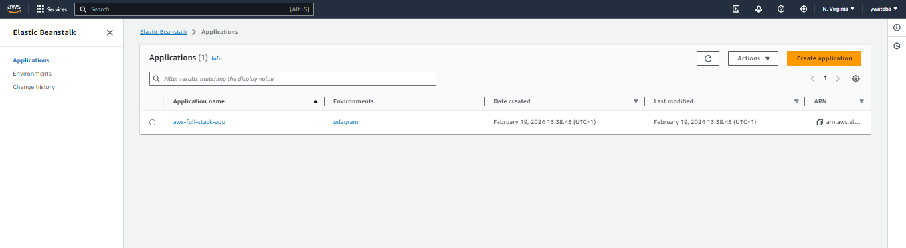

# AWS Full Stack Apps image Search App

This project showcases a simple deployment on Elastic Beanstalk.
Its a simple api writen in javascript.


## Getting Started

### Requirements

To run the project you nedd to have the follwing install

- `npm`
- `Awscli`
- `ebscli`

### How to deploy the project

```bash
    eb init #  follow instructions given by the prompt

    # then

    eb create <env_name> --profile your_aws_profile

    #After some minutes , the project will be deployed.

    eb open # to go to the deployment page
```


### EBS Dashboard




### Deployment page

  - http://udagram.us-east-1.elasticbeanstalk.com/


## License

[License](LICENSE.txt)
